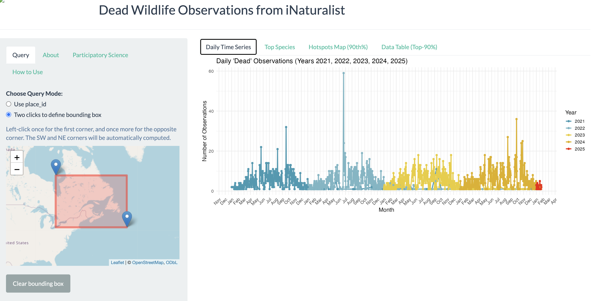
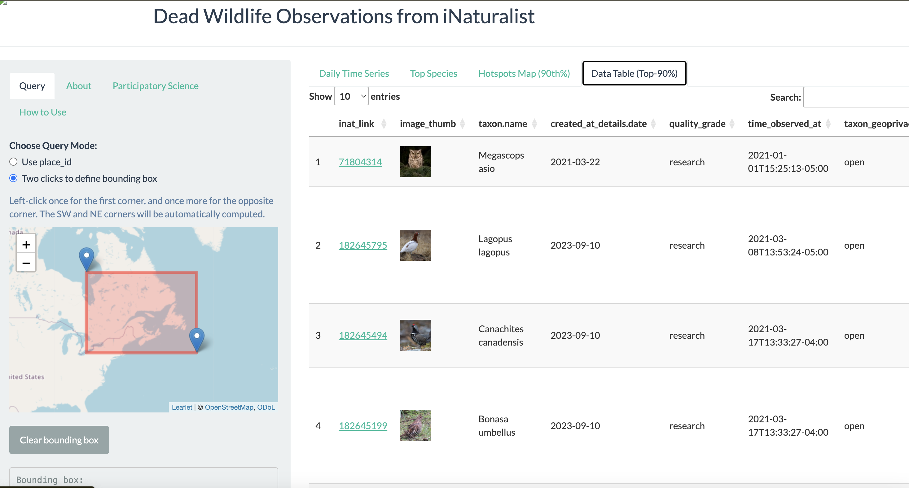

# Inat mortality detector

Analysis and Shiny App

## Overview
The **iNat Mortality Detector** is a data-driven tool designed to analyze wildlife mortality trends based on observations from [iNaturalist](https://www.inaturalist.org/). It provides insights into species-specific mortality patterns across regions, time, anthropogenic, biotic and environmental factors.

## Features
- **Interactive Visualization**: Explore mortality hotspots using dynamic maps and plots.
- **Species Analysis**: Generate reports for specific species or groups (birds, mammals, etc.).
- **Data Integration**: Combines iNaturalist data with custom filtering and query options.

This tool is powered by **R** and **Shiny**, leveraging reproducible workflows and dynamic visualization capabilities. It’s a valuable resource for ecologists, conservationists, and researchers studying biodiversity.

## Installation
Clone the repository

The framework provides an intuitive and interactive interface for analyzing wildlife mortality data. Below are screenshots showcasing the key components:

### 1. Interactive Map

This interactive map highlights mortality hotspots for various species, enabling easy visualization of trends across regions.

### 2. Species Analysis Dashboard

The dashboard allows users to delve deeper into mortality patterns, filter by species, and generate reports.

Designed by Diego Ellis Soto
email: diego.ellissoto@berkeley.edu

